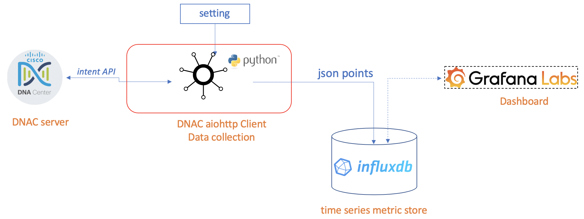

[](https://developer.cisco.com/codeexchange/github/repo/yijxiang/DNAC_aiohttp_client)

# What is DNAC aiohttp client

This client demostrate to request async. API calls to cisco DNAC using aiohttp, runs as module "telegraf" in the TIG stack (telegraf/influx/grafana).

[Telegraf](https://github.com/influxdata/telegraf) is an agent for collecting, processing, aggregating, and writing metrics, the **DNAC aiohttp client** does:

- trigger to collect metric: periodically to run the api calls target to DNAC
- processing the collected JSON data
- write to influx database using python client: [ aioinflux ](https://aioinflux.readthedocs.io/en/stable/)

It was inspired by https://github.com/CiscoDevNet/DNAC-NOC.git. 

## Architecture



## HOW to run this client

### DNAC aiohttp client setup

#### Step 1: Create folder and clone the project

- Create new root folder for your application or demo.
- Clone it and checkout using your favourite python IDE such as pycharm.

#### Step 2: Setup Python virtual enviroment

###### Creating Virtual Environments

Python version 3.6.x - 3.8.x was recommended in this client because of:

  - **asyncio** was introduced into after python 3.5.x.
  - aiohttp need python 3.5+
  - aioinflux need python 3.6+

> **_INFO:_**  *Python Version 3.8.2 have been tested on MAC OS and Windows 10.*


Next, setup the python enviroments.

- Go into the root application folder, create your python virtual enviroment using "virtualenv" and install all packages, for MAC OS or linux:

``` 
virtualenv venv --python=python3 --no-site-packages
source venv/bin/activate
pip install -r requirements.txt 
```

If you runs *Windows OS*, you can use following scripts instead:

``` 
python3 -m venv venv
cd venv\Scripts
activate.bat
pip install -r requirements.txt 
```

> **_INFO for windows user:_**  If you have *error: Microsoft Visual C++ 14.0 is required* when you use *pip install* **ciso8601** , please reference to [ stackoverflow.com ](https://stackoverflow.com/questions/29846087/microsoft-visual-c-14-0-is-required-unable-to-find-vcvarsall-bat). In my home PC which runs *windows 10*, installation will be finished successfully after those fix:
> - upgrade setuptools: *pip install --upgrade setuptools*
> - use [this link](http://go.microsoft.com/fwlink/?LinkId=691126&fixForIE=.exe.) download Visual C++ 2015 Build Tools and install.


> **_INFO:_**  Python virtual enviroment will be installed in the folder *venv* under your application root folder.


- Check the python and packages was installed successfully.

``` 
python
pip list
```

> **_INFO:_**  Check the python version, and compare the output of *PIP list* and the file *requirements.txt*


###### Files description in this project

In your root folder, files in folder *aio_client* lists as this table. Here is file description which can help you better understanding this project:

| File name        | description                                                  |
| ---------------- | ------------------------------------------------------------ |
| dnac_env.py      | DNAC config, **sandbox2** was selected by default            |
| logging.yaml     | python Logging setting                                       |
| requirements.txt | python package list, under *root folder*                     |
| client.py        | **main** entry module for this client                        |
| request.py       | module used for aiohttp request get, post and token          |
| helper.py        | module used for helper function                              |
| sitehealth.py    | module used for specific api: /dna/intent/api/v1/site-health |


As required, you can also add or edit files in your project, at least you should modify the file **dnac_env.py**, *sandbox2* will be used by default if you just for test purpose and DO NOT want to use your own DNAC server:

- In *dnac_env.py*, please make sure to change the DNAC server as yours and **ENVIRONMENT_IN_USE** as *"customer"* or one different name which is not same as the existing one: *sandbox* or *sandbox2*:

``` python
ENVIRONMENT_IN_USE = "customer"

# "customer" Lab Backend, if you select "customer"
DNA_CENTER = {
    "host": "",
    "port": 443,
    "username": "",
    "password": ""
}
```

> **_INFO:_**  
> - In your DNAC server, the bundle named "**DNA Center REST API**" should be activated under *Platform->Manage->Bundles* menu.
> - Document about this API */dna/intent/api/v1/site-health* can be found under *Platform->Developer Toolkit->APIs->Get site health* menu in your DNAC server. 
> - For detail information, please check the official link for [Cisco DNA Center API Reference](https://developer.cisco.com/site/dna-center-rest-api/)


> **_Pay Attention:_**  *Please DO NOT change files name or delete it*


#### Step 3: influxdb and grafana install - OPTION STEP

If you do not want to write data to DB, please go ahead to step4 to run the python script directly.

You can also setup influxdb via [ link to InfluxDB latest:1.8 ](https://docs.influxdata.com/influxdb/v1.8/introduction/install/), and grafana via [ link to Grafana latest ](https://grafana.com/docs/grafana/latest/).

On _mac os_, you can using **brew** tool to install&run the open sourced influxdb and grafana for the demo purpose.

```
# install influxdb
brew install influxdb
brew install grafana

# runs influxdb
brew services start influxdb
brew services start grafana

# stop all services
brew services stop --all

# list all services
brew services list

```

If you use *windows*, you'd better to try to install it via official web site by yourself, following is the links for your reference.
- From [Grafana site](https://grafana.com/grafana/download?platform=windows), select the *windows* icon, download the installer.
- From [influxdb site](https://portal.influxdata.com/downloads/), select *Windows Binaries (64-bit)*, download the *ZIP* file then unzip it on windows.


#### Step 4: Customize the config and run python app.

You should make some little change according to your requirement in file *client.py* although it's no problem to run *python client.py* directly.

##### Changes to support influxDB if you finished step-3

If you have installed the influx database as above option step-3 and want to store data points, make the following changes:

In *client.py*, if you use **aioinflux** python client to store time series data to Influx:
  - set the IP address of influx database server, by default *127.0.0.1* is used in local installation;
  - set the *influxdb_write_enable* to *True*;

``` python
influxdb_client_host_ip = "127.0.0.1"        # influx client host ip, should be modified according to your app
influxdb_write_enable = True                 # If you use influxDB to store data, please change it to True
```

When client runs, in the console, you should notify some logging info included *write to influxdb points* :
```
2020-04-27 09:56:48,988 - INFO - write to influxdb points: 3
```

> **_INFO:_**  *write to influxdb points: 3* means total 3 data points have been written into influx database


##### RUN period setting to 60 seconds or more

- In *client.py*, you'd better change the *tasks_runs_every_n_seconds* to 60/120/300 seconds to satisfy your real requirements.

``` python
tasks_runs_every_n_seconds = 60                 # tasks periods, should be modified according to your app
```

> **_Pay Attention:_**  *After the DNAC version **1.3.1.5+** and **1.3.3.4+** of DNAC, the number of API calls of site health has been enhanced from 5 to 100 per minute*


##### Changes for the loop setting

- In *client.py*, you can set **runs_infinitely** True if you want to run it continuously for demo purpose.

``` python
runs_infinitely = True                       # False: exit after runs 3 times, True: runs infinitely
```

##### Run it

After finished previous modification or maybe nothing changes at all, please go into *aio_client* folder, run your app.
``` 
python client.py

2020-04-30 21:02:32,987 - INFO - collect task runs every 30s
2020-04-30 21:02:32,987 - INFO - The target DNAC Server is: sandboxdnac2.cisco.com
2020-04-30 21:02:32,988 - INFO - looping 1 start
2020-04-30 21:02:33,983 - INFO - Token alive: 0.00 min, refreshed successfully!
In building: NSYD5, for Network Device/Clients: Count- 1/1, Healthy Percent- 100/100, for Wireless/Wired Clients: Count- 1/None, Healthy Percent- 100/None
In building: MX14, for Network Device/Clients: Count- 1/8, Healthy Percent- 100/88, for Wireless/Wired Clients: Count- None/8, Healthy Percent- None/88
In building: HQ, for Network Device/Clients: Count- 3/None, Healthy Percent- 100/None, for Wireless/Wired Clients: Count- None/None, Healthy Percent- None/None
2020-04-30 21:02:35,098 - INFO - looping no.1 took: 2.11s, api failed/total: 0/2

```
From the output, you can get the *site health info* for all building with details about devices and clients from your DNAC server periodically.


> **_INFO:_**  Please ignore the warning: 
> - UserWarning: Pandas/Numpy is not available. Support for 'dataframe' mode is disabled.
> - warnings.warn(no_pandas_warning)
 

### THE END: Happy coding with Cisco DNA Center